# Galaxy MIDI Dataset Technical Report

***

### Title Card
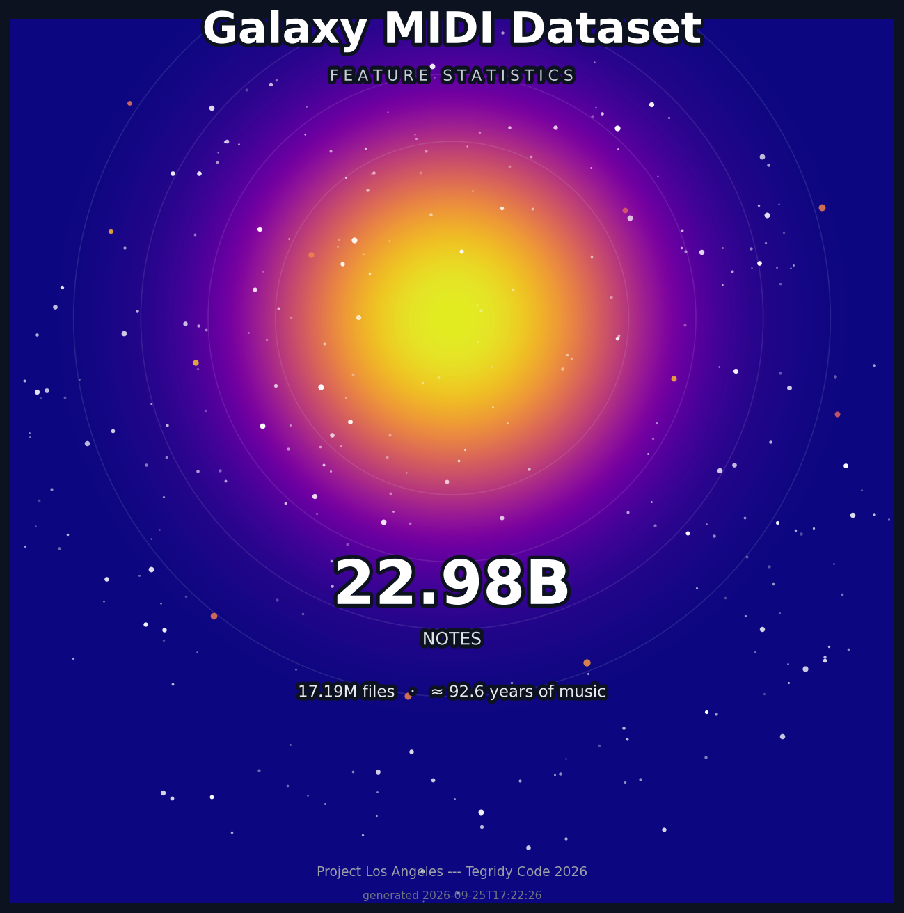

 

### Feature Statistics
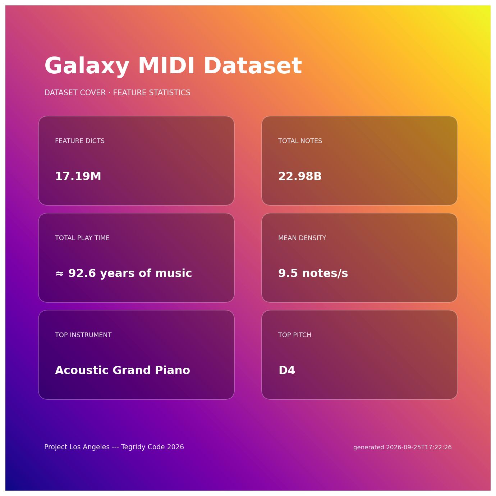

 

### Overview
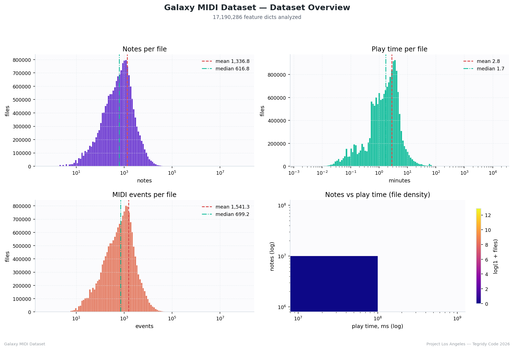

 

### Quality
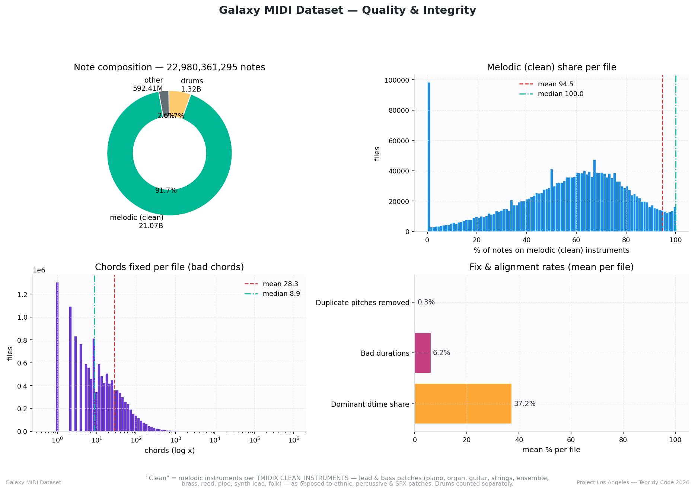

 

### Vocabulary
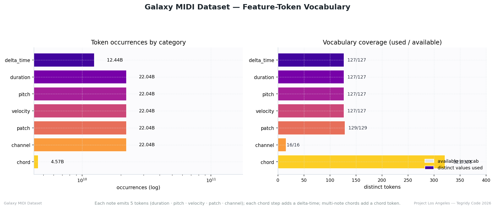

 

### Pitches
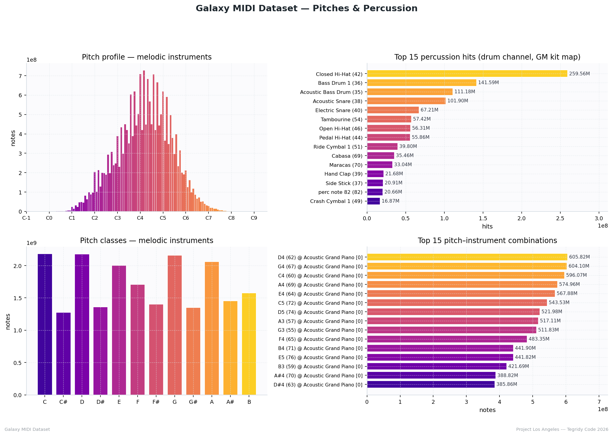

 

### Instruments
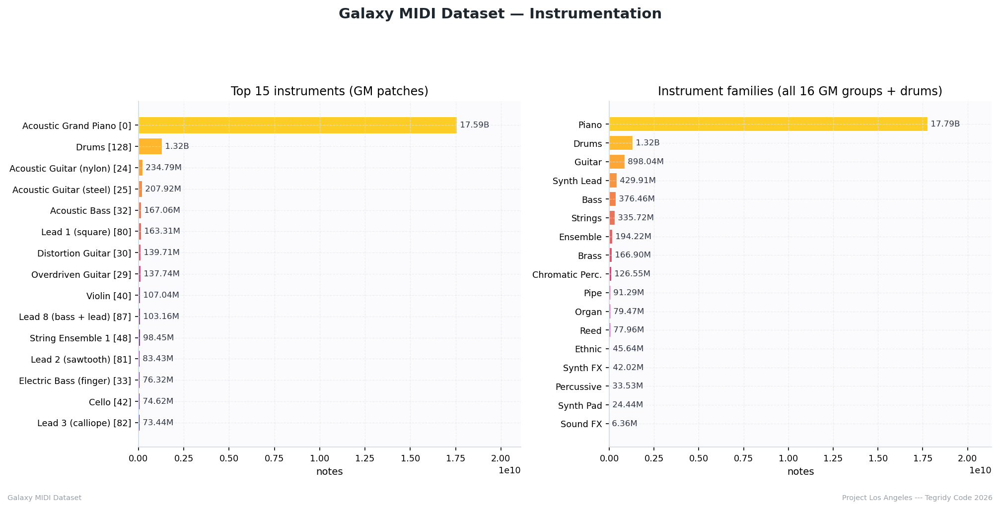

 

### Pitch x Instrument Heatmap
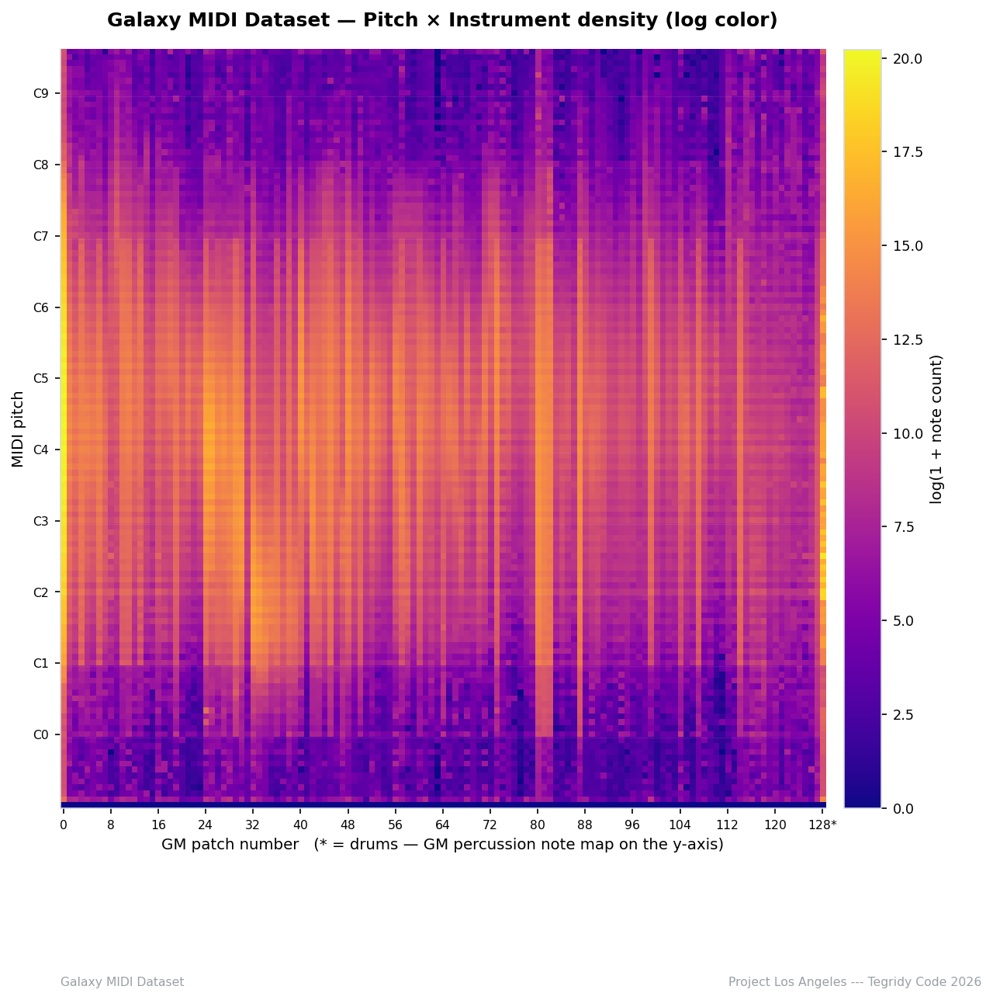

 

### Timing
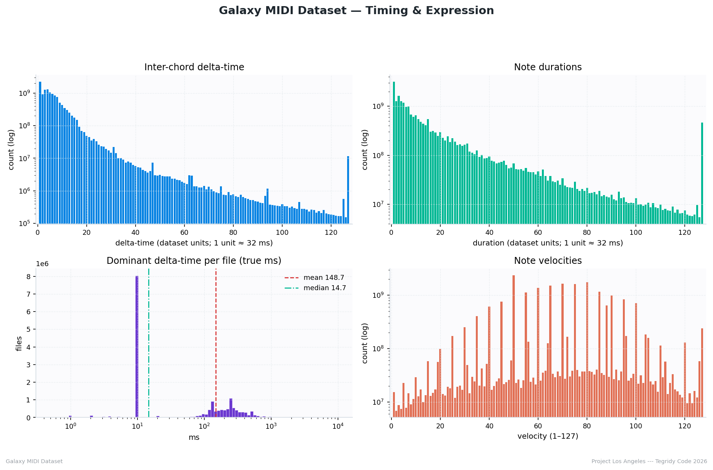

 

### Chords
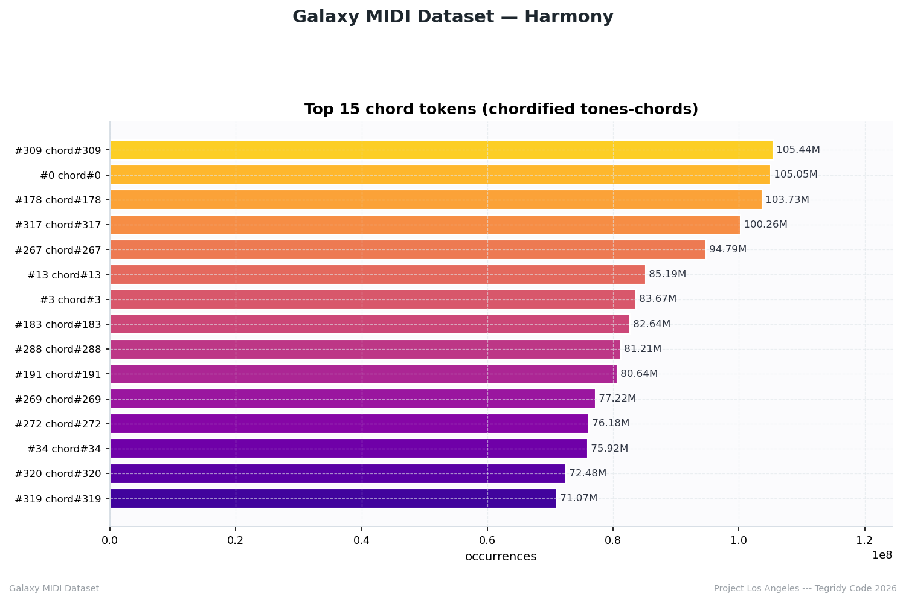

 

### Pitch-Class Galaxy
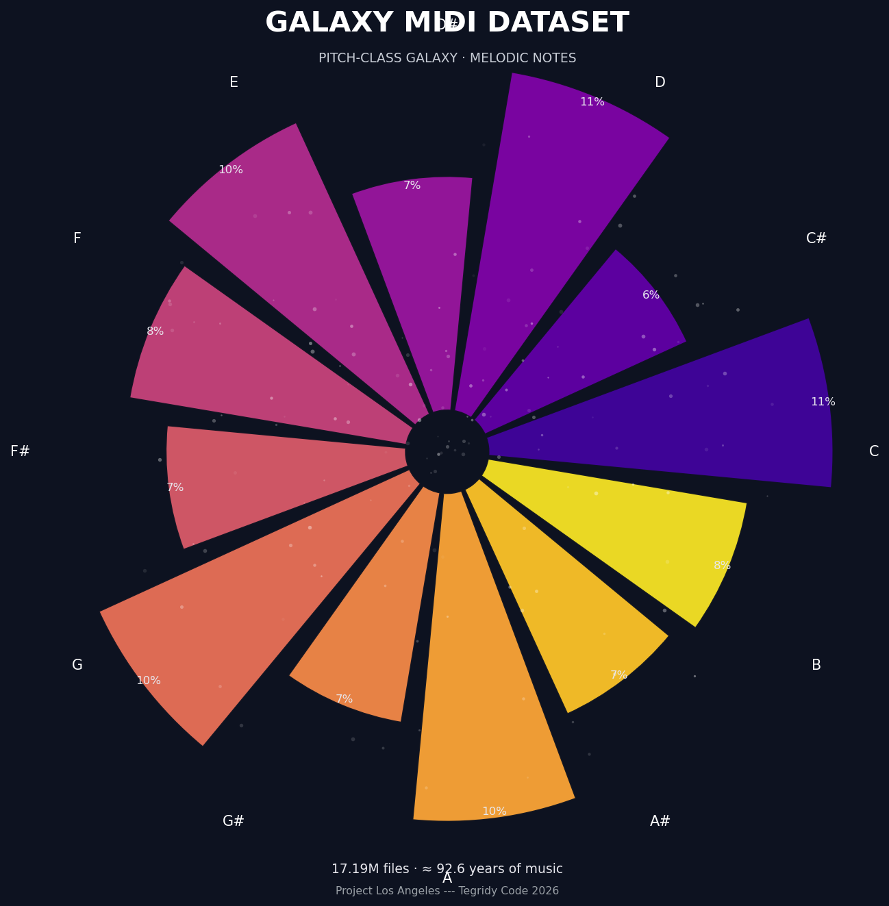

***

### Project Los Angeles
### Tegridy Code 2026
